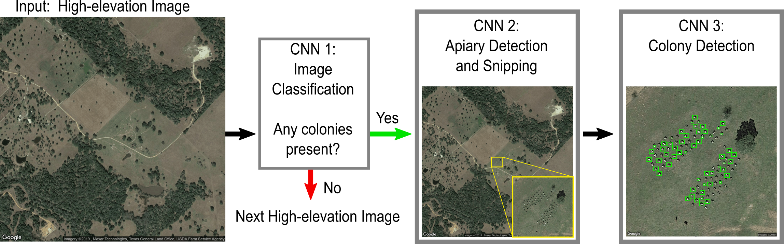

# Honey Bee ML Census Project
*Note*: there are many tools we will be using in this project
(python, Anaconda, PyCharm, GitHub, Amazing Web Services servers, 
etc.) so it may take some practice to get proficient. Once we set up
the basics with GitHub and PyCharm together, we will mostly be
focusing on writing the code and getting familiar with the GitHub 
tools. 

## First Steps:
1. Read about [object detection](https://www.datacamp.com/community/tutorials/object-detection-guide).
   
1. Finish reading through this document.
   
1. Skim [Ryan Kellogg's RA manual](https://github.com/kelloggrk/Kellogg_RA_Manual/wiki/Overview)
   (focus on the Project Management section).
   
1. If you haven't used Git before, read [this article](https://www.freecodecamp.org/news/learn-the-basics-of-git-in-under-10-minutes-da548267cc91/)
   or something similar. Make a practice repo and try commiting, pushing, 
   pulling, and branching. PyCharm makes it easier to do these, but you 
   should understand how these basic commands work.
   
1. - install [Anaconda](https://www.
   anaconda.com/products/individual#Downloads)
   - Install [PyCharm community version](https://www.jetbrains.com/pycharm/download/#section=windows)
   - create a GitHub account if needed and send Aaron the username so he 
     can add you as a collaborator on the repository
   
1. Schedule time with Aaron to set up PyCharm and review GitHub repo.
   

## Background
### Project Background
Having good estimates of the the distribution of managed honey bees
in the United States is both intrinsically important to biologists
and also serves as an important input to other analyses. Current
estimates are expensive to administer and may have large unknown
sampling error because they rely on voluntary response. We wish to
verify these estimates by creating a US census of honey bee boxes
using free or low-cost satellite imagery and machine learning tools.

### Goals
- Build a dataset of honey bee box locations and apiary
  characteristics for the US using satellite imagery and several
  machine learning tools.
- Use the dataset to estimate statistics of the apiary and
  box distributions (e.g., county and state estimates).

### Organization
Borrowing ideas from [Ryan Kellogg's RA manual](https://github.com/kelloggrk/Kellogg_RA_Manual/wiki/Overview):
1. *End-to-end production*: we want to be able to reproduce 
   _everything_ we do by rerunning one script. During
   development, we may want to save intermediate data steps to
   increase speed, but we should always be able to go back and
   run everything from scratch.
   
1. *Replicable and shareable code*: We can share the code with
   others who ask about it using GitHub. Replication, however,
   means more than just giving people access to the GitHub repo
   and letting them look over the code. Replicability means 
   meaningful documentation. This will happen mainly in 
   comments inside of code and in README.md files inside some
   directories.

1. *Unambiguous process*: Keeping GitHub issues up to date 
   and folders free of half-finished or legacy files.
   
### GitHub & PyCharm
We will use GitHub issues to keep track of tasks (as layed out
in Kellogg's RA Manual) and branching, commits, and comments on 
commits to communicate. This may sound like a lot to learn but
speeds up communication and production in major ways. Within code,
we can use `TODO:` comments to leave ourselves notes on what is left
to do in a specific script.

### Python Programming Standards
When possible, we'll try to follow the [PEP-8 python style guide](https://pep8.org/).
PEP-8 offers a way to make sure our code is reasonably
formatted to allow other python programmers to read our code.
Some main style points:
- try to stick to the 79-character limit in code -- it makes
  reading the code much easier.
  
- document your code often using comments and docstrings. To start,
  write a docstring for every function. It can be just one sentence
  if it's obvious what the function does or a long description
  of inputs and outputs and typical results for more complicated
  functions / classes. See the [PEP-8 section on commenting](https://pep8.org/#comments)
  for tips on in-line comments.

## Application Procedure
1. Select extent (geometric boundaries) of area to search.
   
1. Reduce search area by removing some USDA land types that are
   unlikely to have bee boxes on them using GIS software, 
   driven by python.
   
1. Search remaining area by cutting into 1200'x1200' (or larger)
   images.

1. Download 1200'x1200' images (in batches or entirely depending
   on storage space).
   
1. (ML1) Apply a binary classifier to each 1200'x1200' image
   to check for the presence of bee boxes (returns: True/False).
   If an image is identified to have bee boxes, pass image to 
   ML2; skip otherwise.

1. (ML2) Apply an object identifier to the image to find the
   group of bee boxes in 1200'x1200' image (returns: bounding 
   box of group of bee boxes).
   
1. Download new image zoomed in on bounding box from ML2.
   
1. (ML3) Apply an object identifier to find each bee box in the
   new image (returns: list of bounding boxes, one for each 
   identified bee box).
   
1. Generate characteristics of apiary: (date of image, centroid,
   density, number of boxes, list of centers, etc.)
   
1. Save bee box and apiary characteristics to database.

   
## Programming Outline
Phase 1: Using as few data points as possible, build entire 
   process, end-to-end. 

Phase 2: Apply process to a county in Pennsylvania (or other 
   state with a lot of ground truth data available from BIP). 
   Train more and make corrections.

Phase 3: Apply process to Pennsylvania (or whichever state we 
   choose).

Phase 4: Apply process to US.

| Phase.Step | Description |
|------|-------------|
| 1.1 | Setup: build apiary characteristic database, setup unit tests.  |
| 1.2 |  |
| 1.3 |  |
| 1.2 |  |
| 1.2 |  |

  
## Glossary
| Term   | Description |
|---------|-------------|
| Bee box | a small box kept in a field to maintain a managed honey bee colony. They come in different shapes and colors but often are white and about 1.5' by 2' when looking at from above. Can be anywhere from 1' to 4' tall.|
| Apiary | a group of managed bee boxes |
| Unit test | testing the smallest piece of code that can be logically isolated in a system using the smallest set of data to produce a valid result. Often a unit test will be set up as a test of a function, where the input is a single piece of data (e.g., an image) and the output is tested against what we know the output should be. See the Unit Testing section for more.|
| ML | Machine Learning |
| Classifier | an ML model to classify an image into one of several categories. In this project, we will train a binary classifier to tell us if there is (or is not) any bee boxes in an aerial image. |

## Unit Testing
### Goal
To be able to regularly test many parts of the code to see if
we've broken anything. The unit tests are set up to test if
functions that were working correctly in the past are still
outputting the same results. Within a single unit test of a
function, we may add multiple `assert` type tests, where we
check the assertion that the result matches our expectations.

This might sound like a lot of work, but it actually saves a lot
of time in the long run. We often spend hours testing and
retesting parts of the code because it is outputting something
unexpected or when we changed one function, it broke something
down the line. Unit tests can be set up to automatically run
every time we make a change to the code, so we will know
immediately if our change had unexpected consequences.

## Major ToDos
- finish programming outline

- add project by-week timeline
      
- find the best way to store data that can be synced across
  machines but not to GitHub. 
  (git [large files storage](https://git-lfs.github.com/)?)
  
- input major tasks as GitHub issues

- decide on database structure