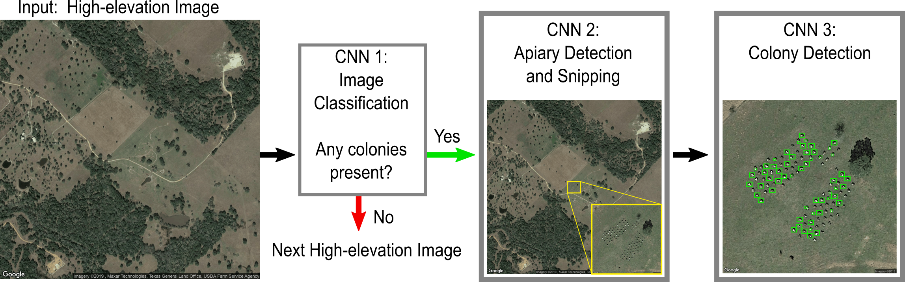

# Honey Bee ML Census Project

Package Name: beecensus

Version: 0.1

Package Description: (1) Train several machine learning neural networks to 
identify managed honey bee boxes from satellite images. Then, given a geographical 
area, (2) search satellite images of that area to build a dataset of bee box locations, 
then (3) calculate characteristics of the groups of boxes and aggreate statistics 
for the geographical area.

Setup/installation procedure: see `INSTALL.md`

Directory structure: see `docs/package_organization.md`

Liscense: See the liscence statement at the bottom of `code_/main.py`

For steps on contributing to the project: see `docs/contributing.md`


# Project Pipeline


## Application Pipeline
1. Select geographic boundaries (latitude and longitude) of area to search. 
   We can do this by saving the boundaries of all counties and states in 
   files and selecting which counties and/or states to search.
   
1. Reduce search area by removing some USDA land types that are
   unlikely to have bee boxes on them using geopandas or GIS software 
   driven by python
   
1. Search remaining area by cutting into 1200'x1200' (or larger)
   images.

1. Download 1200'x1200' images centered on a lat-lon location from google
   Earth (in batches or all together depending on storage space). We will want
   to download all images available for that location with our chosen date
   range. Perhaps there is info in the metadata about the resolution of the 
   image and we can use that to filter out too low resolution images?
   
1. (ML1) Apply a binary classifier to each 1200'x1200' image
   to check for the presence of bee boxes (returns: True/False).
   If an image is identified to have bee boxes, pass image to 
   ML2; skip otherwise.
   
   *Update: Classification models do not report to do well on small objects,
   but modified object detection Faster R-CNN models seem to be the 
   standard in small-object detection (Yun et al., 2018). So seems that we 
   might combine this and the next step.*
   
   Alternatively, we could chop the larger image into smaller sections and 
   feed that to the binary classifier. We would need to encode the math to 
   calculate the lat-lon of each smaller image.

1. (ML2) Apply an object identifier to the image to find the
   group of bee boxes in 1200'x1200' image (returns: bounding 
   box of group of bee boxes).
   
1. Download new image zoomed in on bounding box from ML2.
   
1. (ML3) Apply an object identifier to find each bee box in the
   new image (returns: list of bounding boxes, one for each 
   identified bee box).
   
1. Generate characteristics of apiary: (date of image, centroid,
   density, number of boxes, list of centers, etc.)
   
1. Save bee box and apiary characteristics to database.



## Programming Outline
Phase 1: Using as few images as possible, build entire 
   process, end-to-end. Create training data and test edge cases.

Phase 2: Apply process to a county in Pennsylvania (or other 
   state with a lot of ground truth data available from BIP). 
   Create more training data, train on more images, and make corrections. 

Phase 3: Apply process to Pennsylvania (or whichever state we 
   choose).

Phase 4: Apply process to US.

| Phase.Step | Description |
|------|-------------|
| 1.1 | Setup GitHub: start repo, input project issues, add collaborators. |
| 1.2 | Collect some test images: get 10 high-altitude images that do and do not contain apiaries. Create training data (draw boxes). Demo point-and-click code from Robin Kiff. |
| 1.3 | ML Model Selection: decide which ML model to use in high-altitude filter. May need to test on test images, may need to collect more test images or make new images with rotations and translation of already gathered images. |
| 1.4 | Setup: build apiary characteristic database, setup unit tests. |

## Glossary
| Term   | Description |
|---------|-------------|
| Bee box | a small box kept in a field to maintain a managed honey bee colony. They come in different shapes and colors but often are white and about 1.5' by 2' when looking at from above. Can be anywhere from 1' to 4' tall.|
| Apiary | a group of managed bee boxes |
| Unit test | testing the smallest piece of code that can be logically isolated in a system using the smallest set of data to produce a valid result. Often a unit test will be set up as a test of a function, where the input is a single piece of data (e.g., an image) and the output is tested against what we know the output should be. See the Unit Testing section for more.|
| ML | Machine Learning |
| Object Identifier | an ML model to identify objects in an image. Can be use to identify one or many different types of objects and one or many objects of a any type.
| Classifier | an ML model to classify an image into one of several categories. In this project, we will train a binary classifier to tell us if there is (or is not) any bee boxes in an aerial image. |


## Unit Testing
### Goal
To be able to regularly test many parts of the code to see if
we've broken anything. The unit tests are set up to test if
functions that were working correctly in the past are still
outputting the same results. Within a single unit test of a
function, we may add multiple `assert` type tests, where we
check the assertion that the result matches our expectations.

This might sound like a lot of work, but it actually saves a lot
of time in the long run. We often spend hours testing and
retesting parts of the code because it is outputting something
unexpected or when we changed one function, it broke something
down the line. Unit tests can be set up to automatically run
every time we make a change to the code, so we will know
immediately if our change had unexpected consequences.

## Major ToDos
- finish programming outline (don't think object classification will be 
  useful here).

- add project by-week timeline
      
- find the best way to store data that can be synced across
  machines but not to GitHub. 
  (git [large files storage](https://git-lfs.github.com/)?)
  
- input major tasks as GitHub issues

- decide on database structure


## Satellite Imagery
**Pennsylvania**: [PEMA Orthoimagery Color (1/2ft)](https://www.pasda.psu.edu/uci/SearchResults.aspx?Keyword=PEMA+Orthos)

**Google Earth**: Seems of equal quality, and we already have the 
point-and-click code to use it over multiple years.


## Dependencies
### python moduals
We can install all the needed dependencies in a virtual conda environment:
```shell
conda create --name tf python=3.7
conda activate tf
conda install pathlib pywinauto pyqt5-sip libxml2 imageio IPython google-colab dacite
pip install tensorflow tf-models-official labelImg image_slicer gitpython lvis --user
```
If on windows, need to additionally install windows-friendly `pycocotools` library
```shell
pip uninstall pycocotools
pip install pycocotools-windows
```

- tensorflow 2 (see `code_/build_/ml_models/README_ml-models.md` for pip 
  installation) for machine learning models
  
- image_slicer (must use `pip install image_slicer`, not updated on conda) 
  for cuting up images
  
- pathlib (`conda install pathlib`) for Path manipulation
  
- pywinauto (`conda install pywinauto`) for window/application manipulation 
  (for google earth pro)
  
- PyQt5 (`conda install pyqt5-sip`) for matplotlib plots to display.

- xml (`conda install libxml2`) for converting xml files to csv

- imageio (`conda install imageio`)

- IPython (`conda install IPython`)

- google-colab (`conda install google-colab`)

- gitpython (`pip install gitpython`) for cloning git repos

- labelImg (`pip install labelImg`) for creating training data by drawing boxes on 
  images.
  
- lvis (`pip install lvis`) a tools package that tensorflow depends on that 
  sometimes gets left out of the installation process.
  
- dacite (`conda install dacite`) creates data classes (PEP 557) from dictionaries 
  for use in creating a project config object
  
- git clone TensorFlow models git repo (see section below)


### TensorFlow Models Git Repository
This code depends on having the TensorFlow Models repo inside our repo. 
This repo was cloned into our repo using git bash and the following code. 
This is written here for documentation purposes. After cloning the 
`beecensus` repo, you can skip step 1 below and complete steps 2 and 3.


1. Clone the TF models repo:
```
cd beecensus
git clone https://github.com/tensorflow/models.git
```

2. Install protobuf:
> Go to this page to find the downloadable files for the latest version of Protobuf: https://www.github.com/google/protobuf/releases/latest
>
> Download the zip file beginning with protoc for your OS.
>
> Extract the zip contents and place the folder somewhere on your 
> computer (in the program files). E.g., 
> `D:\Programs\protoc-3.17.3-win64\`


3. Install the contained python packages (will install `dll`'s on your 
   computer, so we need to run this on each new computer after cloning the 
   beecensus repo to install properly). Make sure to replace 
   `D:/Programs/protoc-3.17.3-win64/bin/protoc.exe` below with your path to 
   the `protoc.exe` executable that you just extracted:
```shell
cd models/research
# Compile protos.
D:/Programs/protoc-3.17.3-win64/bin/protoc.exe object_detection/protos/*.proto --python_out=.
# Install TensorFlow Object Detection API.
cp object_detection/packages/tf2/setup.py .
python -m pip install --use-feature=2020-resolver .
# Test the installation.
python object_detection/builders/model_builder_tf2_test.py
```
At the end of the test, you should see some output like this indicating 
that all the tests passed (no need to read through all the tests unless 
you're curious):
```shell
Ran 24 tests in 28.470s

OK (skipped=1) # this indicates that there were no failed tests
```

Note: there will be many CUDA errors while using TF (the first one I see 
during the test is 
`'cudart64_110.dll'; dlerror`). We can safely ignore these CUDA errors as 
the note after the first error explains: "Ignore above cudart dlerror if you 
do not have a GPU set up on your machine." This GPU/CUDA errors will appear but
do not affect the running of TF when using CPU instead of GPU.

### Changes made to TensorFlow scripts
- to run the main program (`model_main_tf2.py`) and model-saving program 
  (`exporter_main_v2.py`) from outside the models directory, I 
  needed to add the models/research directory to the python path. Since 
  `model_main_tf2.py` and `exporter_main_v2.py` are called necessarily using the 
  command line, I needed to edit 
  the path from inside `model_main_tf2.py` and `exporter_main_v2.py`; I added the following to the imports 
  *before* importing object_detection:
  ```python
  import sys
  from pathlib import Path
  research_dir = Path(sys.path[0]).parent
  sys.path.insert(0, str(research_dir))
  ```

# Initial Setup Procedure
- Install Anaconda 3 (includes python 3)
  - create virtual env beecensus python=3.7
  - conda install [dependencies]
  - pip install [dependencies]
- Install PyCharm
  - open repo as project
  - set beecensus as project interpreter  
- setup git repo
  - install git
  - SSH key, add to your account
  - clone beecensus repo
  - activate models subrepo using protoc from TF section above
- Google Earth Pro


1. Install 

## References
Ren, Yun, Changren Zhu, and Shunping Xiao. “Small Object Detection in Optical Remote Sensing Images via Modified Faster R-CNN.” Applied Sciences 8, no. 5 (2018): 813. https://www.researchgate.net/publication/325268539_Small_Object_Detection_in_Optical_Remote_Sensing_Images_via_Modified_Faster_R-CNN/fulltext/5b02c27f0f7e9be94bda8ed0/Small-Object-Detection-in-Optical-Remote-Sensing-Images-via-Modified-Faster-R-CNN.pdf.

